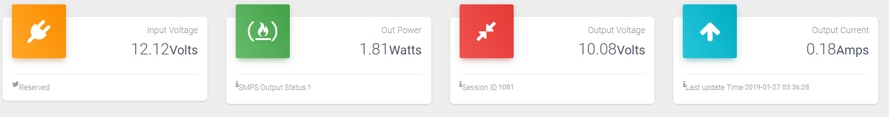

### Connected Power Supply with logging to webserver.

Video Link: [VIDEO](https://bit.ly/41K1Vx9)

### Arduino Libraries: 

* [espsoftwareserial](https://github.com/plerup/espsoftwareserial) by [Peter Lerup ](https://github.com/plerup)
* [Modbus-Master-Slave-for-Arduino](https://github.com/smarmengol/Modbus-Master-Slave-for-Arduino) by [samuel](https://github.com/smarmengol)

### Web UI Snapshots: 

* UI is based on [Material Dashboard](https://www.creative-tim.com/product/material-dashboard) by [creative Tim](https://www.creative-tim.com/)
* For charts [MorrisJS](https://morrisjs.github.io/morris.js/index.html) is used. 

1. Realtime Parameters
        
1. Power Variation Graph during my Test
        
1. Voltage and Current Variation Graph during my Test
        

